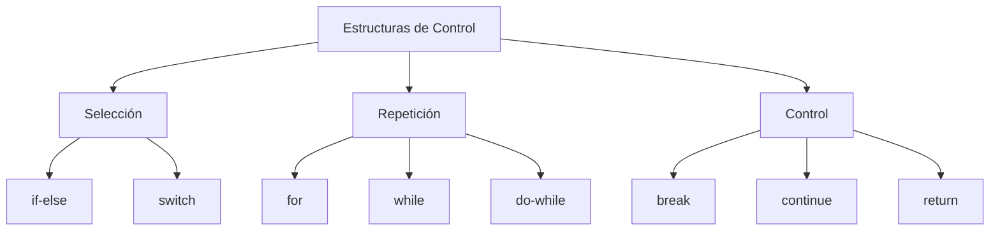

# Ejercicios de Estructuras de Control en C++

---

## 🟢 **Nivel Fácil**  
*Ejercicios introductorios para practicar estructuras básicas*

---

### 🔹 Ejercicio 1: Determinación de Paridad  
**Descripción**: Crea un programa que reciba un número entero y determine si es par o impar  
**Entrada**: Un número entero (ej: 7)  
**Salida**: "El número 7 es impar"  
```text
Ejemplo de ejecución:
>> Ingrese un número: 7
<< El número 7 es impar
```

---

### 🔹 Ejercicio 2: Clasificador Numérico  
**Descripción**: Clasifica un número ingresado en positivo, negativo o cero  
**Entrada**: Un número entero (ej: -5)  
**Salida**: "El número -5 es negativo"  
```text
Ejemplo de ejecución:
>> Ingrese un número: -5
<< El número -5 es negativo
```

---

### 🔹 Ejercicio 3: Verificador de Múltiplo  
**Descripción**: Verifica si un número es múltiplo de 5  
**Entrada**: Número entero (ej: 25)  
**Salida**: "25 es múltiplo de 5"  
```text
Ejemplo de ejecución:
>> Ingrese un número: 25
<< 25 es múltiplo de 5
```

---

### 🔹 Ejercicio 4: Comparador de Valores  
**Descripción**: Compara dos números e indica su relación de orden  
**Entrada**: Dos números enteros (ej: 8 y 12)  
**Salida**: "8 < 12"  
```text
Ejemplo de ejecución:
>> Ingrese dos números: 8 12
<< 8 < 12
```

---

### 🔹 Ejercicio 5: Suma de Secuencia  
**Descripción**: Calcula la suma de los primeros N números naturales  
**Entrada**: Número entero positivo (ej: 5)  
**Salida**: "Suma = 15"  
```text
Ejemplo de ejecución:
>> Ingrese N: 5
<< Suma de los primeros 5 números = 15
```

---

## 🟡 **Nivel Medio**  
*Ejercicios que requieren combinación de estructuras y lógica más compleja*

---

### 🔸 Ejercicio 6: Calculadora Básica  
**Descripción**: Implementa una calculadora con operaciones básicas (+, -, *, /)  
**Entrada**: Dos números y operador (ej: 6, 3, '/')  
**Salida**: "6 / 3 = 2"  
```text
Ejemplo de ejecución:
>> Ingrese operación (num1 op num2): 6 / 3
<< Resultado: 2
```

---

### 🔸 Ejercicio 7: Cálculo de Factorial  
**Descripción**: Calcula el factorial de un número no negativo  
**Entrada**: Número entero no negativo (ej: 4)  
**Salida**: "4! = 24"  
```text
Ejemplo de ejecución:
>> Ingrese número: 4
<< 4! = 24
```

---

### 🔸 Ejercicio 8: Identificador de Primos  
**Descripción**: Determina si un número es primo  
**Entrada**: Número entero positivo (ej: 11)  
**Salida**: "11 es un número primo"  
```text
Ejemplo de ejecución:
>> Ingrese número: 11
<< 11 es un número primo
```

---

### 🔸 Ejercicio 9: Generador de Secuencia Fibonacci  
**Descripción**: Genera los primeros N términos de Fibonacci  
**Entrada**: Entero positivo (ej: 5)  
**Salida**: "0, 1, 1, 2, 3"  
```text
Ejemplo de ejecución:
>> Ingrese N: 5
<< Serie Fibonacci: 0 1 1 2 3
```

---

### 🔸 Ejercicio 10: Contador de Dígitos  
**Descripción**: Cuenta los dígitos de un número entero  
**Entrada**: Número entero (ej: -1234)  
**Salida**: "Número de dígitos: 4"  
```text
Ejemplo de ejecución:
>> Ingrese número: -1234
<< Número de dígitos: 4
```

---

### 🔸 Ejercicio 11: Sumador de Dígitos  
**Descripción**: Calcula la suma de los dígitos de un número  
**Entrada**: Número entero (ej: 123)  
**Salida**: "Suma de dígitos: 6"  
```text
Ejemplo de ejecución:
>> Ingrese número: 123
<< Suma de dígitos: 6
```

---

### 🔸 Ejercicio 12: Generador de Tablas de Multiplicar  
**Descripción**: Muestra la tabla de multiplicar de un número  
**Entrada**: Número entero (ej: 7)  
**Salida**: Tabla del 1 al 10  
```text
Ejemplo de ejecución:
<< Tabla del 7:
<< 7 x 1 = 7
<< 7 x 2 = 14
<< ...
<< 7 x 10 = 70
```

---

## 🔴 **Nivel Difícil**  
*Ejercicios avanzados que combinan múltiples estructuras con algoritmos*

---

### 🔺 Ejercicio 13: Cálculo de Máximo Común Divisor  
**Descripción**: Calcula el MCD usando el algoritmo de Euclides  
**Entrada**: Dos enteros positivos (ej: 54, 24)  
**Salida**: "MCD(54, 24) = 6"  
```text
Ejemplo de ejecución:
>> Ingrese dos números: 54 24
<< MCD(54, 24) = 6
```

---

### 🔺 Ejercicio 14: Identificador de Números Perfectos  
**Descripción**: Determina si un número es perfecto  
**Entrada**: Entero positivo (ej: 28)  
**Salida**: "28 es un número perfecto"  
```text
Ejemplo de ejecución:
>> Ingrese número: 28
<< 28 es un número perfecto
```

---

### 🔺 Ejercicio 15: Conversor Decimal-Binario  
**Descripción**: Convierte número decimal a binario  
**Entrada**: Entero positivo (ej: 10)  
**Salida**: "10 en binario: 1010"  
```text
Ejemplo de ejecución:
>> Ingrese número: 10
<< Binario: 1010
```

---

### 🔺 Ejercicio 16: Generador de Secuencia Collatz  
**Descripción**: Genera secuencia Collatz para un número  
**Entrada**: Entero positivo (ej: 6)  
**Salida**: "6 → 3 → 10 → 5 → 16 → 8 → 4 → 2 → 1"  
```text
Ejemplo de ejecución:
>> Ingrese número: 6
<< Secuencia Collatz: 6 3 10 5 16 8 4 2 1
```

---

### 🔺 Ejercicio 17: Verificador de Palíndromos Numéricos  
**Descripción**: Determina si un número es palíndromo  
**Entrada**: Entero positivo (ej: 12321)  
**Salida**: "12321 es palíndromo"  
```text
Ejemplo de ejecución:
>> Ingrese número: 12321
<< 12321 es palíndromo
```

---

### 🔺 Ejercicio 18: Generador de Patrones Estelares  
**Descripción**: Imprime patrón triangular de asteriscos  
**Entrada**: Altura del triángulo (ej: 4)  
**Salida**:  
```text
*
**
***
****
```
```text
Ejemplo de ejecución:
>> Altura: 4
<< *
<< **
<< ***
<< ****
```

---

### 🔺 Ejercicio 19: Aproximador de π  
**Descripción**: Aproxima π usando la serie de Leibniz  
**Entrada**: Número de iteraciones (ej: 10000)  
**Salida**: "Aproximación de π: 3.14159"  
```text
Ejemplo de ejecución:
>> Iteraciones: 10000
<< π ≈ 3.14159
```

---

### 🔺 Ejercicio 20: Juego de Adivinación Numérica  
**Descripción**: Implementa juego donde se adivina número aleatorio  
**Entrada**: Intentos del usuario  
**Salida**: Retroalimentación y conteo de intentos  
```text
Ejemplo de ejecución:
>> Adivina el número (1-100): 50
<< Mayor! Intento 1
>> 75
<< Menor! Intento 2
>> ...
<< ¡Correcto! Adivinaste en 5 intentos
```

---

## 📚 Soluciones Completas  
Las soluciones detalladas para cada ejercicio están disponibles en:  
[GitHub Repositorio](https://github.com/tu-usuario/cpp-estructuras-control)

## 🔗 Recursos Adicionales  
- [Referencia oficial de C++](https://cplusplus.com/doc/tutorial/control/)  
- [Compilador online](https://www.onlinegdb.com/online_c++_compiler)  
- [Ejercicios interactivos](https://www.learn-cpp.org/)  



¡Domina estas estructuras y estarás listo para los siguientes desafíos de programación! 💻🚀