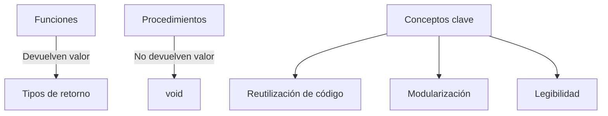

# 🎯 Funciones y Procedimientos en C++ - Guía para Clases



## 📚 Teoría Básica

### 1. ¿Qué son funciones y procedimientos?
- **Función** → Bloque de código que realiza una tarea y **devuelve un valor**
  - Ejemplo: `double calcularArea(double radio)`
- **Procedimiento** → Bloque de código que realiza una tarea **sin devolver valor** (`void`)
  - Ejemplo: `void mostrarMenu()`
- **Ventajas clave**:
  - ♻️ Reutilizar código
  - 🧩 Dividir problemas complejos
  - 📂 Mejor organización del programa

### 2. Sintaxis básica

```cpp
// FUNCIÓN (devuelve valor)
tipo_retorno nombre_funcion(parametros) {
    // Cuerpo de la función
    return resultado;
}

// PROCEDIMIENTO (no devuelve valor)
void nombre_procedimiento(parametros) {
    // Cuerpo del procedimiento
    // Sin return
}
```

### 3. Ejemplo práctico

```cpp
#include <iostream>
using namespace std;

// Función matemática
int potencia(int base, int exponente) {
    int resultado = 1;
    for(int i = 0; i < exponente; i++) {
        resultado *= base;
    }
    return resultado;
}

// Procedimiento de interfaz
void mostrarResultado(int base, int exp, int res) {
    cout << base << "^" << exp << " = " << res << endl;
}

int main() {
    int num = 2;
    int exp = 3;
    int resultado = potencia(num, exp);
    mostrarResultado(num, exp, resultado);
    return 0;
}
```

---

## 💻 20 Ejercicios Prácticos

### 🟢 Nivel Fácil
1. Suma de dos números enteros
2. Imprimir "Hola Mundo"
3. Calcular área de un rectángulo
4. Convertir Celsius a Fahrenheit
5. Imprimir números del 1 al 10
6. Determinar si un número es par o impar
7. Calcular el cuadrado de un número

### 🟡 Nivel Medio
8. Encontrar el máximo de dos números
9. Calcular factorial (iterativo)
10. Imprimir tabla de multiplicar
11. Determinar si un número es primo
12. Sumar primeros N números naturales
13. Calcular área de un triángulo
14. Convertir minutos a horas y minutos

### 🔴 Nivel Difícil
15. Calcular Máximo Común Divisor (MCD)
16. Calcular término N de Fibonacci
17. Imprimir triángulo de asteriscos
18. Determinar si un número es perfecto
19. Sumar dígitos de un número
20. Simular reloj digital

---

