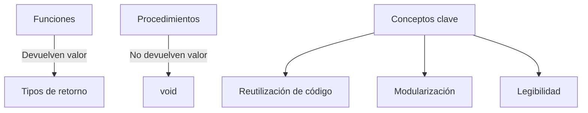

# 🎯 Funciones y Procedimientos en C++ - Guía para Clases



## 📚 Teoría Básica

### 1. ¿Qué son funciones y procedimientos?
- **Función** → Bloque de código que realiza una tarea y **devuelve un valor**
  - Ejemplo: `double calcularArea(double radio)`
- **Procedimiento** → Bloque de código que realiza una tarea **sin devolver valor** (`void`)
  - Ejemplo: `void mostrarMenu()`
- **Ventajas clave**:
  - ♻️ Reutilizar código
  - 🧩 Dividir problemas complejos
  - 📂 Mejor organización del programa

### 2. Sintaxis básica

```cpp
// FUNCIÓN (devuelve valor)
tipo_retorno nombre_funcion(parametros) {
    // Cuerpo de la función
    return resultado;
}

// PROCEDIMIENTO (no devuelve valor)
void nombre_procedimiento(parametros) {
    // Cuerpo del procedimiento
    // Sin return
}
```

### 3. Ejemplo práctico

```cpp
#include <iostream>
using namespace std;

// Función matemática
int potencia(int base, int exponente) {
    int resultado = 1;
    for(int i = 0; i < exponente; i++) {
        resultado *= base;
    }
    return resultado;
}

// Procedimiento de interfaz
void mostrarResultado(int base, int exp, int res) {
    cout << base << "^" << exp << " = " << res << endl;
}

int main() {
    int num = 2;
    int exp = 3;
    int resultado = potencia(num, exp);
    mostrarResultado(num, exp, resultado);
    return 0;
}
```

---

## 💻 20 Ejercicios Prácticos

### 🟢 Nivel Fácil
1. Suma de dos números enteros
2. Imprimir "Hola Mundo"
3. Calcular área de un rectángulo
4. Convertir Celsius a Fahrenheit
5. Imprimir números del 1 al 10
6. Determinar si un número es par o impar
7. Calcular el cuadrado de un número

### 🟡 Nivel Medio
8. Encontrar el máximo de dos números
9. Calcular factorial (iterativo)
10. Imprimir tabla de multiplicar
11. Determinar si un número es primo
12. Sumar primeros N números naturales
13. Calcular área de un triángulo
14. Convertir minutos a horas y minutos

### 🔴 Nivel Difícil
15. Calcular Máximo Común Divisor (MCD)
16. Calcular término N de Fibonacci
17. Imprimir triángulo de asteriscos
18. Determinar si un número es perfecto
19. Sumar dígitos de un número
20. Simular reloj digital

---

## ✅ Soluciones

### 🟢 Soluciones Nivel Fácil
```cpp
// 1. Suma de dos números
int suma(int a, int b) {
    return a + b;
}

// 2. Hola Mundo
void holaMundo() {
    cout << "👋 Hola Mundo!" << endl;
}

// 3. Área de rectángulo
double areaRectangulo(double base, double altura) {
    return base * altura;
}

// 4. Celsius a Fahrenheit
double celsiusToFahrenheit(double celsius) {
    return (celsius * 9/5) + 32;
}

// 5. Números del 1 al 10
void imprimir1a10() {
    for(int i = 1; i <= 10; i++) {
        cout << i << " ";
    }
    cout << endl;
}

// 6. Par o impar
string parImpar(int num) {
    return (num % 2 == 0) ? "Par ✅" : "Impar ❌";
}

// 7. Cuadrado de un número
double cuadrado(double num) {
    return num * num;
}
```

### 🟡 Soluciones Nivel Medio
```cpp
// 8. Máximo de dos números
int maximo(int a, int b) {
    return (a > b) ? a : b;
}

// 9. Factorial iterativo
int factorial(int n) {
    int resultado = 1;
    for(int i = 2; i <= n; i++) {
        resultado *= i;
    }
    return resultado;
}

// 10. Tabla de multiplicar
void tablaMultiplicar(int num) {
    cout << "Tabla del " << num << ":" << endl;
    for(int i = 1; i <= 10; i++) {
        cout << num << " × " << i << " = " << num*i << endl;
    }
}

// 11. Número primo
bool esPrimo(int n) {
    if(n < 2) return false;
    for(int i = 2; i <= n/2; i++) {
        if(n % i == 0) return false;
    }
    return true;
}

// 12. Suma primeros N naturales
int sumaNaturales(int n) {
    return n * (n + 1) / 2;
}

// 13. Área de triángulo
double areaTriangulo(double base, double altura) {
    return (base * altura) / 2;
}

// 14. Convertir minutos
void convertirMinutos(int minutos) {
    int horas = minutos / 60;
    int minutos_rest = minutos % 60;
    cout << minutos << " minutos = ";
    cout << horas << " h y " << minutos_rest << " min" << endl;
}
```

### 🔴 Soluciones Nivel Difícil
```cpp
// 15. Máximo Común Divisor (MCD)
int mcd(int a, int b) {
    while(b != 0) {
        int temp = b;
        b = a % b;
        a = temp;
    }
    return a;
}

// 16. Fibonacci (iterativo)
int fibonacci(int n) {
    if(n <= 1) return n;
    int a = 0, b = 1, c;
    for(int i = 2; i <= n; i++) {
        c = a + b;
        a = b;
        b = c;
    }
    return b;
}

// 17. Triángulo de asteriscos
void trianguloAsteriscos(int filas) {
    for(int i = 1; i <= filas; i++) {
        for(int j = 1; j <= i; j++) {
            cout << "⭐ ";
        }
        cout << endl;
    }
}

// 18. Número perfecto
bool esPerfecto(int n) {
    int suma = 0;
    for(int i = 1; i <= n/2; i++) {
        if(n % i == 0) suma += i;
    }
    return suma == n;
}

// 19. Suma de dígitos
int sumaDigitos(int num) {
    int suma = 0;
    while(num != 0) {
        suma += num % 10;
        num /= 10;
    }
    return suma;
}

// 20. Reloj digital (versión simplificada)
void relojDigital() {
    for(int h = 0; h < 24; h++) {
        for(int m = 0; m < 60; m++) {
            cout << (h < 10 ? "0" : "") << h << ":";
            cout << (m < 10 ? "0" : "") << m << endl;
        }
    }
}
```

---